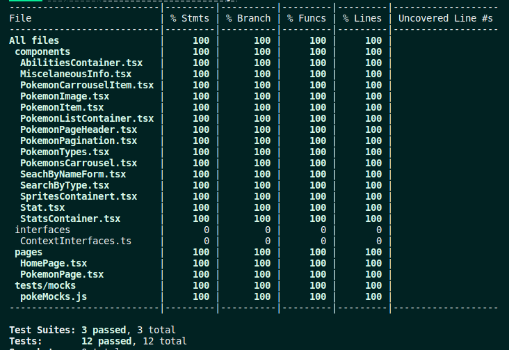

# Pokédex Project

Este projeto é uma aplicação Pokédex que utiliza as tecnologias React, React Router, React Query, RTL e Tailwind, consumindo a PokeAPI para retornar informações sobre os Pokémons.

## Funcionalidades

-   Lista de 12 Pokémons na página inicial, com paginação
-   Possibilidade de pesquisar por nome
-   Filtro por Tipo
-   Página específica de cada Pokémon, que mostra:
    -   Habilidades
    -   Tamanho e peso
    -   Stats
    -   Sprites

## Instalação

1.  Clone este repositório para sua máquina local
```bash
git clone git@github.com:pedroayresb/desafiofrontend.git
```
2.  Instale as dependências
```bash
npm install
```

3.  Inicie a aplicação
```bash
npm start
```

## Testes
A aplicação possui testes de integração, e atualmente tem todos os componentes e funções testados
  
## Tecnologias utilizadas

-   React
-   React Router
-   React Query
-   RTL
-   Tailwind
-   PokeAPI
